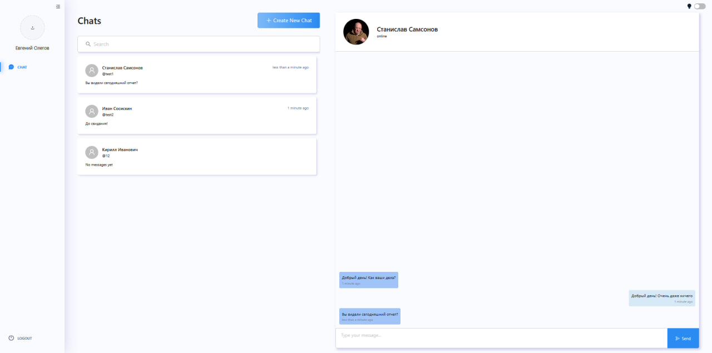

# Чат приложение

Веб-приложение для личных чатов с авторизацией, списком диалогов, отправкой сообщений, статусом последней активности пользователя и обновлением чатов в реальном времени через GraphQL subscriptions.

## Скриншот UI



## Структура проекта

Проект собран как npm workspace:

- `apps/frontend` - клиентское приложение на React/Apollo/Vite.
- `apps/backend` - API на NestJS, GraphQL и Prisma.
- `package.json` в корне - общие команды через Turbo.

## Запуск проекта

### Установка зависимостей

```bash
npm install
```

### Запуск всего проекта

```bash
npm run dev
```

Команда запускает frontend и backend через Turbo.

### Запуск по отдельности

Frontend:

```bash
cd apps/frontend
npm run dev
```

Backend:

```bash
cd apps/backend
npm run dev
```

### Сборка

Сборка всего проекта:

```bash
npm run build
```

Сборка frontend:

```bash
cd apps/frontend
npm run build
```

Сборка backend:

```bash
cd apps/backend
npm run build
```

## База данных

Backend использует PostgreSQL и Prisma. Основные команды:

```bash
cd apps/backend
npm run db:create
npm run db:migrate
npm run db:seed
```

Переменные окружения backend находятся в `apps/backend/.env`. Для локального запуска нужны параметры подключения к PostgreSQL:

```env
DB_USERNAME=postgres
DB_PASSWORD=postgres
DB_DATABASE=chat
DB_DEFAULT_DATABASE=postgres
DB_PORT=5432
DB_HOST=localhost
BACKEND_PORT=4001
SECRET_KEY=secret
FRONTEND_URL=http://localhost:4000
```

Frontend использует `apps/frontend/.env`:

```env
API_BASE_URL=http://localhost:4001/graphql
```

## Основные библиотеки

### Frontend

- React `18.2.0`
- React DOM `18.2.0`
- Vite `5.3.5`
- TypeScript `5.2.2`
- Ant Design `5.17.0`
- Ant Design Icons `5.2.6`
- Apollo Client `3.8.5`
- GraphQL `16.8.1`
- GraphQL WS `^5.16.0`
- React Router DOM `6.16.0`
- Styled Components `6.0.8`
- date-fns `^3.6.0`
- jwt-decode `4.0.0`
- lodash `4.17.21`
- react-infinite-scroll-component `6.1.0`

### Backend

- NestJS Core `10.2.7`
- NestJS GraphQL `12.0.9`
- NestJS Apollo `12.0.9`
- NestJS JWT `10.2.0`
- NestJS Passport `10.0.3`
- NestJS Platform Fastify `10.3.3`
- Apollo Server `4.9.4`
- Fastify `4.26.0`
- Prisma Client `5.4.2`
- Prisma `5.4.2`
- PostgreSQL driver `pg 8.12.0`
- GraphQL `16.8.1`
- GraphQL WS `5.16.0`
- GraphQL PG Subscriptions `3.2.5`
- bcrypt `5.1.1`
- uuid `9.0.1`
- AWS SDK S3 Client `3.569.0`

### Workspace

- Turbo `latest`
- npm `9.5.1`
- ESLint `8.48.0`
- Prettier `3.0.3`
